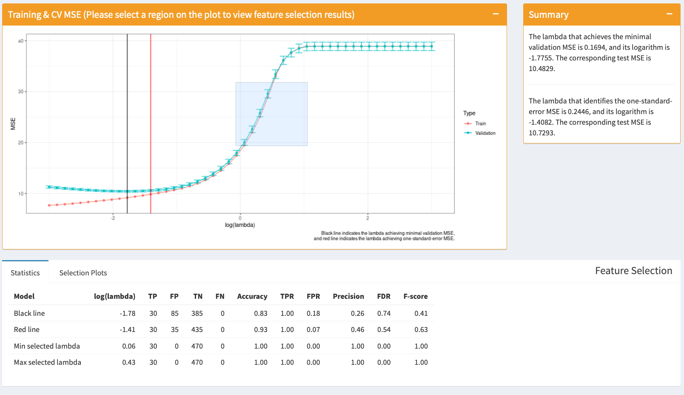
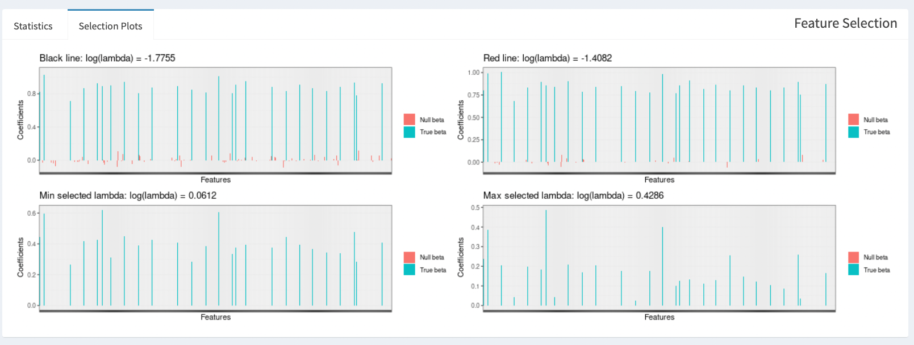
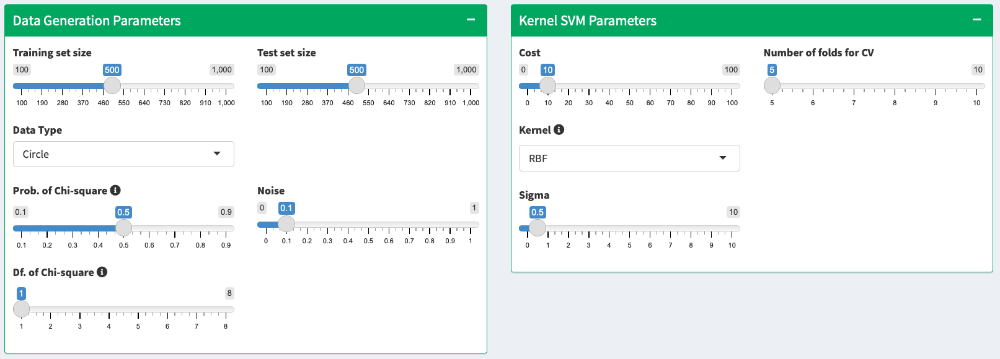
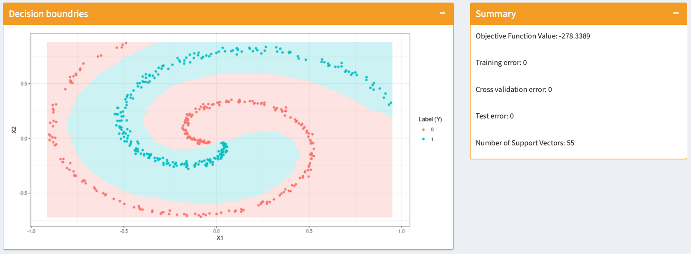

```{r, include = FALSE}
knitr::opts_chunk$set(
  collapse = TRUE,
  comment = "#>"
)
```

## 1. Intoduction

This project builds a powerful Shiny App for people interested in statistical learning simulation, specifically for the regression task for sparse data and the classification task for data without linear decision boundary. We allow users to generate all different types of data and adjust model parameters, so they will have a direct understanding about their actions' influences through the corresponding changes in resulting visualization graphs.

The way of this App doing regression simulation is inspired by the paper *Best Subset, Forward Stepwise or Lasso? Analysis and Recommendations Based on Extensive Comparisons* (Hastie et al., 2020), where a systematic scheme for generating sparse data is provided and the effects of data structures on the performances of Ridge/LASSO/Elastic Net are carefully discussed. The performance here is a two-fold concept, regarding both prediction accuracy and feature selection ability, and the paper especially focus on the feature selection ability of these classical regularized models under different scenarios. For example, high correlation between features (especially between true features and null features) and low signal-noise-ratio lead to weak feature selection of LASSO. The permutation of true features and null features is also relevant in terms of feature selection consistency. These are sensible results coming from the so-called "sparse eigenvalue condition" and the "mutual incoherence condition" -- though beyond the scope of this project, the simulation platform provided by this project would be a good way to validate these theoretical results from the practical side.

This projects particularly provides the user with privileges to tune relevant data generation parameters as well as model specification parameters of  Ridge/LASSO/Elastic Net. The training MSE and cross-validated MSE will be plotted against a range of user-specified regularization parameters, and by cropping out an interested region more feature selection details about that region will be provided as well. 

The classification simulation design of this project is inspired by the [*Tensorflow Neural Network playground*](https://playground.tensorflow.org/) (see Reference 1), which is an outstanding platform for tuning neural networks in order to fit data with complex structures. Although deep learning is known to be a powerful tool for classification, the SVM with all types of kernels is also a competitive algorithm. This project provides the user with options of 4 types of data structures, as well as 8 options of kernel types with their corresponding parameters. Compared with the Neural Network playground that inspired this project, one highlight and improvement of this project is that users are given more options to tune the data generation processes. In order to better visualize the distribution of data points and the decision boundary, here we only consider data with 2 dimensions and 2 classes. 

The regression and classification tasks mentioned above are incorporated into this Shiny App through different tabs on the sidebar menu. Default parameters to generate classical model results have been provided as a beginner-friendly guide. After getting familiar with the playground's basic operations, users can adjust the parameters for data generation and modeling by themselves. The results will be interactively and automatically generated, and visualization will be exhibited at the main panel accordingly.


## 2. Implementation

### 2.1 Regression: Glmnet
The regression task mainly focus on the data generation process and how regularization parameters affect the performances of penalized regression models. Using the `sim.xy` function in the `bestsubset` package, as well as the `cv.glmnet` function in the `glmnet` package, the users are allowed to generate data with desired parameters and conduct cross validation using Ridge/LASSO/Elastic net.

#### 2.1.1 Data Generation

The parameters of data generation include: 

- $n$ (`Training set size`)

- $nval$ (`Test set size`)

- $p$ (`Number of features`)

- $s$ (`Number of nonzero coefficients`)

- $\rho$ (pairwise correlations of the predictors or `Correlation coefficient`)

- $snr$ (signal-to-noise or `SNR`), and 

- $beta.type$ (pattern of the nonzero coefficients or `Beta Type`)

We can define $\beta$ by specifying $beta.type$ and $s$. There are 5 types of $\beta$:

1. Beta-type 1: $\beta$ has $s$ components equal to 1, occurring at roughly equally-spaced indices between 1 and $p$, and the rest coefficients equal to 0;

2. Beta-type 2: $\beta$ has its first $s$ components equal to 1;

3. Beta-type 3: $\beta$ has its first $s$ components taking linear fashion nonzero values between 10 to 0.5; 

4. Beta-type 4: $\beta$ has its first 6 components taking the nonzero values $-10$, $-6$, $-2$, $2$, $6$, $10$;

5. Beta-type 5: $\beta$ has its first $s$ components equal to 1, and the rest decaying to 0 at an exponential rate, i.e., $\beta_i=0.5^{i-s}$, for $i=s+1, \cdots , p$. 

Then the rows of design matrix $X \in \mathbb{R}^{n \times p}$ can be independently and identically drawn from the Gaussian distribution $\mathcal{N}(0, \Sigma)$, where the $ij$-th entry of $\Sigma$ is $\rho^{|i-j|}$. Next, the response variable can be generated from $Y\sim\mathcal{N}(X\beta, \sigma^2I)$, where $\sigma^2$ is defined according to the user-specified SNR, that is, $\sigma^2=\frac{\beta^T \Sigma \beta }{snr}$.

#### 2.1.2 Regularized Regression Model Using `glmnet`

We choose the function `cv.glmnet` to solve the following problem
$$
\min _{\beta_{0}, \beta} \frac{1}{N} \sum_{i=1}^{N} l\left(y_{i}, \beta_{0}+\beta^{T} x_{i}\right)+\lambda\left[(1-\alpha)\|\beta\|_{2}^{2} / 2+\alpha\|\beta\|_{1}\right]
$$

over a grid of user-specified values of $\lambda$ and the user-specified value of $\alpha$, and conduct the procedure of k-fold cross-validation. Here $l\left(y_{i}, \eta_{i}\right)$ is the negative log-likelihood contribution for observation $i$; e.g. for the Gaussian case it is $\frac{1}{2}\left(y_{i}-\eta_{i}\right)^{2}$. The Elastic Net penalty is controlled by $\alpha$, and bridges the gap between LASSO regression ($\alpha=1$, the default) and ridge regression $(\alpha=0)$. The tuning parameter $\lambda$ controls the overall strength of the penalty. Users can tune these parameters of the model with $\alpha$ and $\lambda$ in the Shiny App.

The results obtained from `cv.glmnet` are used to do further analysis in terms of both prediction accuracy and feature selection. Details are provided in section 3.

### 2.2 Classification: Kernel SVM

The classification task mainly focus on the generation of complex-structured data and how different kernels affect the classification ability of SVM. Using the `ksvm` function in the `kernlab` package, the users are allowed to perform the kernel SVM algorithm and see how the decision boundary would change in different scenarios.

#### 2.2.1 Data Generation

This project provides 4 options of data generation.

**Circle** 

The Circle type of data represents a nested circular distribution. The outer ring consists of data of class 2, and the inner ring consists of data of class 1. The two coordinates $X_1$ and $X_2$ of a data point are independently and identically drawn from a standard Gaussian distribution. Then the label $Y$ of the data point can be determined using an intuitive method to decide the boundary -- setting the radius of the inner circle as a quantile of $\chi^2$. In other words, data points outside of the boundary are labeled with 2, and those in the circle are labeled with 1. In addition, noise is added in order to better evaluate the effectiveness of the classification methods. Each data point can be generated using the formula as follows:
$$X_1\sim^{\rm i.i.d} \mathcal{N}(0,1),$$
$$X_2\sim^{\rm i.i.d} \mathcal{N}(0,1),$$
and
$$Y = \mathbb{I}\left( X_1^2 + X_2^2 + \mathcal{N}(0, \epsilon^2) > \chi^2(p, df) \right) + 1,$$

where $\epsilon$ indicates the `Noise` parameter in the App, $p$ indicates the `Prob. of Chi-square` parameter in the App, and $df$ indicates the `Df. of Chi-square` parameter in the App. Users could change the boundary by changing $p$ and $df$, and control the perturbation via the value of $\epsilon^2$.

**XOR**

The XOR type of data is similar to the first one except the way the class labels being determined. When only one of the two coordinates ($X_1$ and $X_2$) is positive or negative, the label $Y$ will be 2, otherwise 1. In other words, data points in the first and the third quadrants have the same labels, while data points in the second and the fourth quadrant share the same labels. Similarly, noise is added to the data. Each data point can be generated using the formula as follows:

$$X_1\sim^{\rm i.i.d} \mathcal{N}(0,\sigma^2),$$
$$X_2\sim^{\rm i.i.d} \mathcal{N}(0,\sigma^2),$$
and 
$$Y = XOR \left( X_1 > \mathcal{N}(0, \epsilon^2), \ X_2 > \mathcal{N}(0, \epsilon^2) \right) + 1.$$
Note that $\sigma$ indicates the `Variability of data` parameter in the App, and $\epsilon$ indicates the `Noise` parameter in the App.


**Gaussian**

The Gaussian type of data represents two groups of bivariate Gaussian distributions. Each data point can be generated using the formula as follows.
For class 1,
$$
\begin{bmatrix}
X_1 \\ X_2
\end{bmatrix}
\sim^{\rm i.i.d}
\mathcal{N}\left( \begin{bmatrix}\mu_{11} \\ \mu_{12} \end{bmatrix},
\begin{bmatrix} \sigma_{11}^2 & \rho_1 \sigma_{11}  \sigma_{12}   \\
\rho \sigma_{11} \sigma_{12}  & \sigma_{12}^2 \end{bmatrix}
 \right).
$$
For class 2,
$$
\begin{bmatrix}
X_1 \\ X_2
\end{bmatrix}
\sim^{\rm i.i.d}
\mathcal{N}\left( \begin{bmatrix}\mu_{21} \\ \mu_{22} \end{bmatrix},
\begin{bmatrix} \sigma_{21}^2 & \rho_2 \sigma_{21}  \sigma_{22}   \\
\rho \sigma_{21} \sigma_{22}  & \sigma_{22}^2 \end{bmatrix}
 \right).
$$
Note that $\mu_{11}$ indicates the `Mu1 of class 1` parameter in the App, $\mu_{12}$ indicates the `Mu2 of class 1` parameter in the App, $\mu_{21}$ indicates the `Mu1 of class 2` parameter in the App, and $\mu_{22}$ indicates the `Mu2 of class 2` parameter in the App. In addition, $\sigma_{11}$ indicates the `Sigma1 of class 1` parameter in the App, $\sigma_{12}$ indicates the `Sigma2 of class 1` parameter in the App, $\sigma_{21}$ indicates the `Sigma1 of class 2` parameter in the App, $\sigma_{22}$ indicates the `Sigma2 of class 2` parameter in the App, $\rho_1$ indicates the `Rho of class 1` parameter in the App, and $\rho_2$ indicates the `Rho of class 2` parameter in the App.

**Spiral**

The Spiral type of data represents two intertwined spiral distributions. Each class of data points can be generated by specifying the polar coordinates of the start and end points, and then specifying other points with equally-spaced polar coordinates in-between. Similarly, noise is added to the data. For class 1, the start point is

$$
\left( X_1, X_2 \right) = \left(r \cdot \cos(t_{11}) + \mathcal{N}(0, \epsilon^2),\ r \cdot \sin(t_{11}) + \mathcal{N}(0, \epsilon^2) \right),
$$
and the end point is
$$
\left( X_1, X_2 \right) = \left(r \cdot \cos(t_{12}) + \mathcal{N}(0, \epsilon^2),\ r \cdot \sin(t_{12}) + \mathcal{N}(0, \epsilon^2) \right).
$$


For class 2, the start point is
$$
\left( X_1, X_2 \right) = \left(r \cdot \cos(t_{21}) + \mathcal{N}(0, \epsilon^2),\ r \cdot \sin(t_{21}) + \mathcal{N}(0, \epsilon^2) \right),
$$

and the end point is
$$
\left( X_1, X_2 \right) = \left(r \cdot \cos(t_{22}) + \mathcal{N}(0, \epsilon^2),\ r \cdot \sin(t_{22}) + \mathcal{N}(0, \epsilon^2) \right).
$$

Note that $r$ indicates the `Radius` parameter in the App, $\epsilon$ indicates the `Noise` parameter in the App, $t_{11}$ and $t_{12}$ indicate the start and end values of the `Angle of class 1` parameter in the App, and $t_{21}$ and $t_{22}$ indicate the start and end values of the `Angle of class 2` parameter in the App.

#### 2.2.2 Kernel SVM Model

We choose the `ksvm` function in the `kernlab` package to conduct the kernel soft-margin SVM algorithm. The (dual) optimization problem is:
\begin{gather*}
\max_{w, \alpha} \quad W(\alpha) = \sum_{i=1}^n \alpha_i - \frac{1}{2} \sum_{i,j}^n y^{(i)}y^{(j)} \alpha_i \alpha_j k(x^{(i)}, x^{(j)}) \\
{\rm s.t.} \quad 0 \leq \alpha_i \leq C, \quad i = 1,\cdots,n \\
\quad \quad \sum_{i=1}^n \alpha_i y^{(i)} = 0.
\end{gather*}

The $C$ here indicates the `Cost` parameter in the App, and types of $k(x^{(i)}, x^{(j)})$ indicates the `Kernel` parameter in the App. The kernel types this App provides include: RBF, Polynomial, Linear, Bessel, Laplacian, Spline, ANOVA RBF, and Hyperbolic tangent. Their corresponding expressions and parameters are:

 - Gaussian RBF kernel: $k(x,x') = \exp(-\sigma\begin{Vmatrix}x-x'\end{Vmatrix}^2)$  
 
 - Polynomial kernel: $k(x,x') = (scale<x,x'>+offset)^{degree}$  
 
 - Linear kernel: $k(x,x') = <x,x'>$  
 
 - Hyperbolic tangent kernel: $k(x,x') = \tanh(scale<x,x'>+offset)$  
 
 - Laplacian kernel: $k(x,x') = \exp(-\sigma\begin{Vmatrix}x - x'\end{Vmatrix})$  
 
 - Bessel kernel: $k(x,x') = (-Bessel_{(\nu+1)}^n\sigma\begin{Vmatrix}x-x'\end{Vmatrix}^2)$  
 
 - ANOVA RBF kernel: $k(x,x') = \sum_{1\leq i_1 \ldots <i_D \leq N}\prod_{d=1}^Dk(x_{id},x_{id}')$ where $k(x,x)$ is a Gaussian RBF kernel.  
 
 - Spline kernel: $k(x,x') = \prod_{d=1}^D 1 + x_i x_j + x_i x_j \min(x_i,x_j) - \frac{x_i+x_j}{2} \min(x_i,x_j)^2 + \frac{\min(x_i,x_j)^3}{3}$  


## 3. Demonstration

### 3.1 Package Dependency and Installation

Before installing the package, the user needs to first install a package called `bestsubset` by running the following code.

```{r eval=FALSE}
library(devtools)
install_github(repo = "ryantibs/best-subset", subdir = "bestsubset")
```

Then the user can install and load this package.

```{r eval=FALSE}
install_github(repo = "Sta523-Fa21/final_proj_simulation_master", 
               subdir = "simulationMaster")
library(simulationMaster)
```

By running the following function, the user opens the Shiny App.

```{r eval=FALSE}
run_simulation_master()
```

After opening this Shiny App, the user can choose whether to do a regression or classification task on the left sidebar menu. 

### 3.2 Regression Demo

For regression with `cv.glmnet`, **data generation parameters** and **model specification parameters** can be tuned and adjusted freely (see Figure 1). We allow the user to select a large bunch of $\lambda$'s at one time. Due to the effects of $\lambda$ of different magnitudes, we choose log($\lambda$) rather than $\lambda$ itself, and we set a lower bound and upper bound for the value of log($\lambda$). Then, our function will generate desired number of equally-spaced $\lambda$ values within this range and fit the model. The corresponding results will be shown below accordingly.

{ width=100% }

The result panels for this regression task are displayed in Figure 2. The user is able to see the **training MSE** and the **cross-validation MSE** with standard error bars in the left panel of the plot. Specifically, the user can select a region on this plot by cropping out a rectangle, and then the corresponding **feature selection** results, which include a statistics table and 4 feature selection plots (see Figure 3), will show in the panel at the bottom. 

In Figure 2, the black vertical line in the plot represents the $\log(\lambda)$ achieving minimum **validation MSE**, and the red line represents the $\log(\lambda)$ achieving **one-standard error MSE**. In Figure 3, 4 models are considered: the top left plot represents the model under the "black line" $\lambda$, the top right plot represents the model under the "red line" $\lambda$, the bottom left plot represents the model under the minimal $\lambda$ that the user chooses, and the bottom right plot represents the model under the maximal $\lambda$ that the user chooses. We can see that larger $\lambda$ leads to more sparse solution. The statistics regarding feature selection results are also displayed (see Figure 2), including True Positive (TP), False Positive (FP), True Negative (TN), False Negative (FN), True Positive Rate (TPR), False Positive Rate (FPR), Accuracy, Precision, False Discovery Rate, and F-score of the 4 interested models.  

The right panel of Figure 2 is a summary of the regression. With the interactive and straightforward results shown in these panels, users will be able to quickly grasp the information they need and further tune and compare the regression models.

{ width=100% }


{ width=100% }


### 3.2 Classification Demo

For classification with kernel SVM, similar to the regression playground, the tuning panels include two parts, **data generation** and **model specification** (see Figure 4). Users can choose different data types and other data generation parameters on the left panel and choose a specific kernel and its corresponding parameters for kernel SVM on the right panel. 

{ width=100% }


In the result panels (see Figure 5), the visualization is shown in the left box and the summary statistics in the right box. The summary statistics include the following terms: objective function values, training error, cross validation error, test error, and number of support vectors.

For the visualization, we paint our data points in two different colors to show their labels, and naturally the decision regions are also painted in the corresponding light colors. We achieve this by dividing the whole space into thousands of grids and coloring them with the color of the predicted class. In this way, users can intuitively perceive the change of classification results of kernel SVM.

{ width=100% }


\newpage

## References

1. Tensorflow Neural Network playground: [`https://playground.tensorflow.org/`](https://playground.tensorflow.org/)

2. Trevor Hastie, Robert Tibshirani and Ryan Tibshirani (2020). Best Subset, Forward Stepwise or Lasso? Analysis and Recommendations Based on Extensive Comparisons. Statistical Science, Vol. 35, No. 4, 579–592. [`https://doi.org/10.1214/19-STS733`](https://doi.org/10.1214/19-STS733)

3. Jerome Friedman, Trevor Hastie, Robert Tibshirani (2010).
  Regularization Paths for Generalized Linear Models via Coordinate
  Descent. Journal of Statistical Software, 33(1), 1-22. [`https://www.jstatsoft.org/v33/i01/`](https://www.jstatsoft.org/v33/i01/)

4. Alexandros Karatzoglou, Alex Smola, Kurt Hornik, Achim Zeileis (2004).
  kernlab - An S4 Package for Kernel Methods in R. Journal of
  Statistical Software 11(9), 1-20. [`http://www.jstatsoft.org/v11/i09/`](http://www.jstatsoft.org/v11/i09/)

